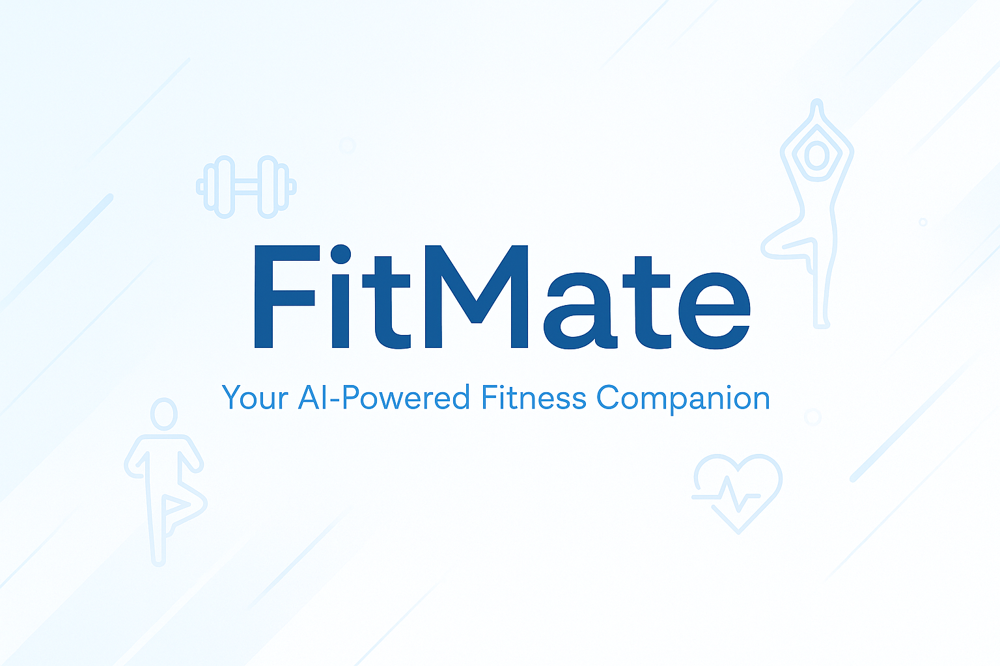
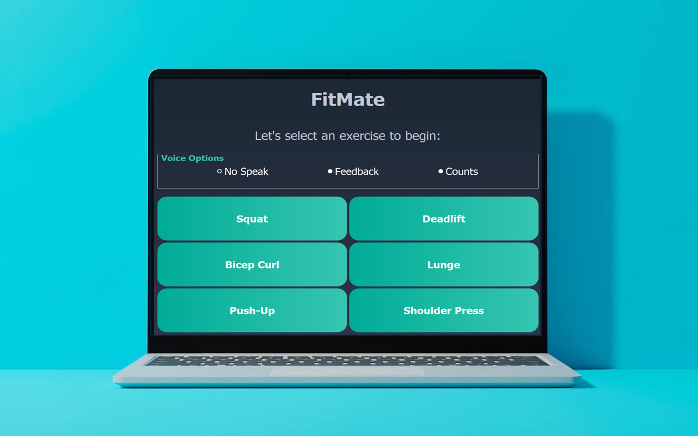
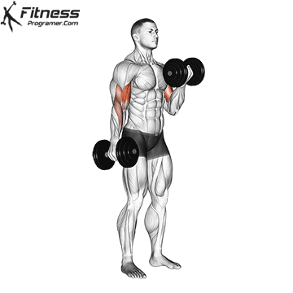
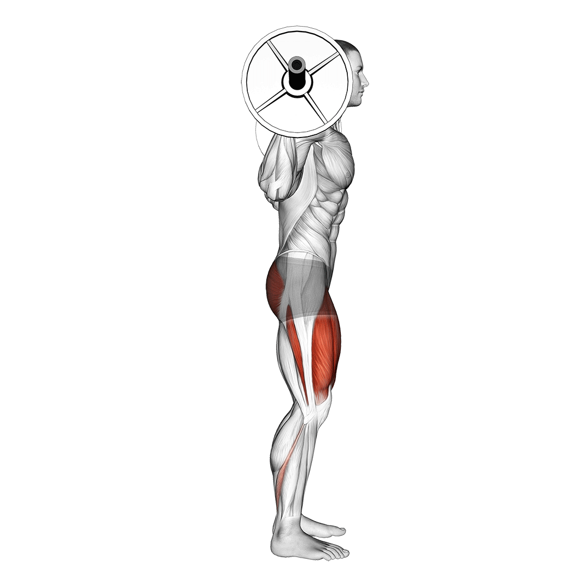
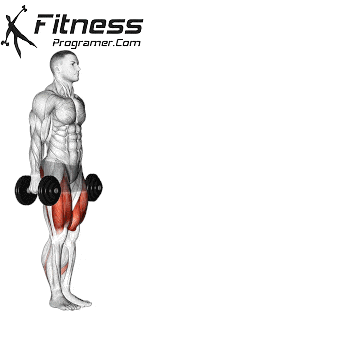
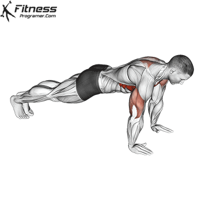
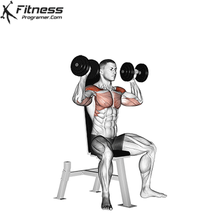
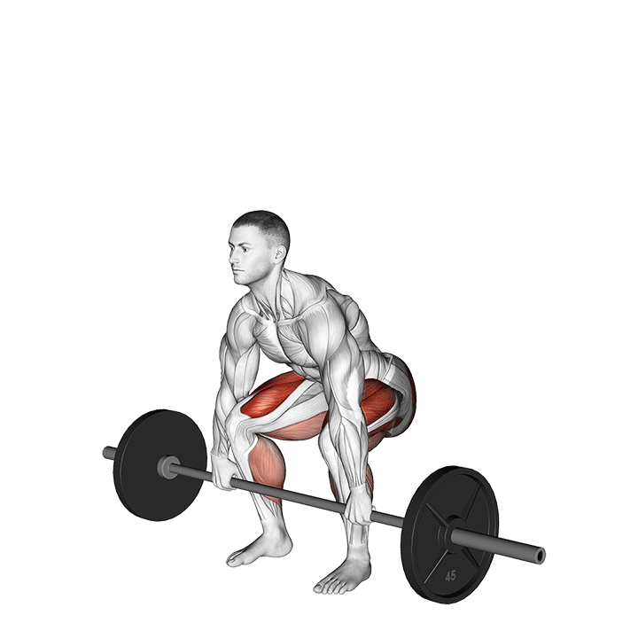

<p align="center">
  
</p>

<h1 align="center">FitMate: Desktop Application</h1>

<p align="center">
  Empower your workout with real-time AI analysis and feedback.
</p>

---

## 📖 Overview

**FitMate** is a desktop application that acts as your personal fitness companion, providing **instant feedback**, **repetition counting**, and **form correction** using advanced **3D pose estimation** powered by **MediaPipe**.  
No wearables, no expensive hardware — just a camera, your body, and FitMate.

Whether you're performing squats, push-ups, or shoulder presses, FitMate helps you stay safe and effective with every rep.

---

## 🖼️ App Interface Mockup

<p align="center">
  
</p>

---

## 🏋️ Supported Exercises

✔️ **Bicep Curl**  
✔️ **Lunge**  
✔️ **Squat**  
✔️ **Push-Ups**  
✔️ **Shoulder Press**  
✔️ **Deadlift**

Each exercise is analyzed using key joint angles, with automated side detection (left/right) and real-time corrective feedback.

---

## 🛠️ Built With

- 🐍 **Python 3**
- 📸 **OpenCV** – for video processing
- 🤖 **MediaPipe Pose (3D Landmark Model)** – for pose estimation
- 🖥️ **PyQt5** – for user interface
- 🧮 **NumPy** – for mathematical computations
- 🔊 **pyttsx3** – for text-to-speech audio feedback

---

## 🚀 Installation

1. **Clone the repository:**
   ```bash
   git clone https://github.com/Ziyad-HF/FitMate.git
   cd FitMate
   ```

2. **Install dependencies:**
   ```bash
   pip install -r requirements.txt
   ```

3. **Run the application:**
   ```bash
   python main.py
   ```

✅ You’re now ready to train with FitMate!

---

## 🎥 Demo Previews

| Exercise        | Demo                                    |
|----------------|----------------------------------------|
| Bicep Curl      |                    |
| Squat           |                    |
| Lunge           |                    |
| Push-Ups        |                   |
| Shoulder Press  |           |
| Deadlift        |                 |

---

## ⚙️ How FitMate Works

1. Captures video input from your webcam.
2. Detects **33 body landmarks** in real-time using MediaPipe’s 3D pose model.
3. Calculates joint angles relevant to the selected exercise.
4. Tracks movement through exercise phases (e.g., up, down).
5. Provides:
   - ✅ **Positive feedback** for correct form
   - ⚠️ **Warnings** for unsafe or incorrect posture
   - 🔢 **Automatic rep counting**
6. Offers **audio feedback** via speech synthesis.

---

## 💡 Pro Tips

- Ensure **full body visibility** in the camera frame.
- Use a **well-lit space** to improve detection accuracy.
- Maintain an appropriate **distance from the camera** (about 1.5–2 meters).
- Supports both **frontal** and **side views** depending on exercise type.

---

## 📝 Future Directions

- Mobile app development for portability
- Integration with cloud services for progress tracking
- Enhanced body alignment calibration
- Custom AI models (e.g., Vision Transformers, YOLO) for improved pose accuracy
- Health metrics analysis and long-term monitoring

---

## 👥 Contributing
<p align="center">
  Made with ❤️ by Team FitMate
</p>
<table>
  <tr align="center">
      <td align="center">
      <a href="https://github.com/Ziyad-HF" target="_black">
      
      <br />
      <sub><b>Ziyad El Fayoumy</b></sub></a>
      </td>
      <td align="center">
      <a href="https://github.com/" target="_black">
      
      <br />
      <sub><b>ِAhmad Kamal</b></sub></a>
      </td>
      <td align="center">
      <a href="https://github.com/AbdulrahmanGhitani" target="_black">
      
      <br />
      <sub><b>Abdulrahman Shawky</b></sub></a>
      </td>
      <td align="center">
      <a href="https://github.com/omarnasser0" target="_black">
      
      <br />
      <sub><b>Omar Abdulnasser</b></sub></a>
      </td>
      <td align="center">
      <a href="https://github.com/amg-eng" target="_black">
      
      <br />
      <sub><b>Amgad Atef</b></sub></a>
      </td>
    </tr>
 </table>

---

